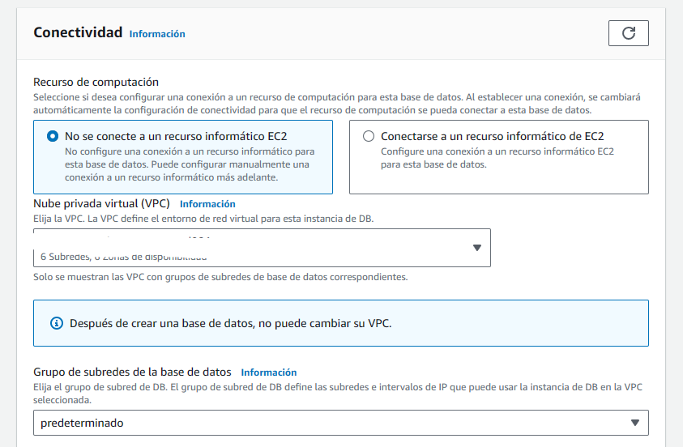

# Change Data Capture with PySpark

1. [Introduction](#1.-introduction)
2. [Proyecto y Arquitectura](#2.-proyecto-y-arquitectura)
3. [Creacion RDS](#3.-creacion-de-rds)
4. [Creacion S3 Bucket](#4.-creacion-s3-bucket)
5. [Creacion de DMS](#5.-creacion-de-dms)
    - [DMS - Source EndPoint]()
    - [DMS - Destination EndPoint]()
    - [DMS Instancia]()
6. [RDS y Dumping Data Connection](#6.-rds-y-dumping-data-connection)
7. [DMS full load](#7.-dms-full-load)
8. [DMS replication ongoing](#8.-dms-replication-ongoing)
9. [Stop instances](#9.-stop-instances)
10. [Glue jobs](#10.glue-jobs)
    - [Full Load]()
    - [Change capture]()
    - [Glue Job CDC]()
11. [Lambda function y Trigger](#11.-lambda-function-y-trigger)
    - [Testing y trigger]()
    - [Obtener FileName]()
    - [Creacion de Glue Job]()
    - [Testing Invoke]()
    - [Writing Glue Shell Job]()
12. [Full load pipeline](#12.-full-load-pipeline)
13. [CDC pipeline](#13.-cdc-pipeline)

## 1. Introduction

CDC sirve cuando tenemos una __base de datos__ que queremos replicar o capturar los cambios dentro de la misma y guardarlo en un archivo o __DataLake__

Los cambios que podemos capturar son __Delete__, __Insert__, __Update__

## 2. Proyecto y Arquitectura

Buscamos que todos los cambios que ocurran dentro de la __Base RDB__ se vean replicados en __HDFS / S3__

Para capturar estos datos vamos a crear un servicio en AWS llamado __DMS__ o __Data migration Service__ que deje en un __Bucket temporal__ el archivo con los cambios.

Cuando llegue un nuevo archivo al __Bucket Temporal__ esto dispara un trigger que activa una __lambda__ que llamará a un __job de PySpark__ usando GLUE pasandole el FileName.

Este __Job de GLUE__ va a leer data del __Bucket Temporal__ y lo pondrá en el __bucket FINAL: HDFS/S3__

## 3. Creacion de RDS

Lo primero que hacemos es crear la Base de datos __RDS__ con MySql, __USAR FREE TIER__

Nombre de la instancia: __mysqlinstance__

Para este proyecto usamos MySql y nos seguramos de usar la capa libre.

Elegimos un nombre de la Instancia y el nombre de usuario es __admin__

Nos aseguramos de estar usando __t3.micro__ porque es gratuito.

En conectividad dejamos los valores __default__

Lo mas importante viene en __configuración adicional__. Acá debemos activar el __backUp__ de la BD ya que es necesario para poder trabajar con __DMS__ y debemos crear __un grupo de parametros adicional__

__Creacion de un grupo de parametros adicional__

Abrimos otra ventana de __RDS__ y seleccionamos __Param Groups__
Creamos el nuevo Grupo para MySql 8.0. Las versiones deben coincidir. 

Visualizamos el Grupo creado.

Al crear el grupo, debemos cambiar el valor de un parametro __binlog_format__ a __ROW__ y guardarlo. 

Con el nuevo grupo disponible lo que hacemos es seleccionar el __Grupo de parametros__ en la ventana de creacion de la BD. Si no se actualiza solo, es necesario hacer __F5__ y volver a cargar.

Y creamos la __BD__

## 4. Creacion de S3 Bucket

## 5. Creacion de DMS

### 5.1 DMS - Source EndPoint

### 5.2 DMS - Destination EndPoint

### 5.3 DMS Instancia

## 6. RDS y Dumping Data Connection

## 7. DMS Full Load

## 8. DMS replication Ongoing

## 9. Stop Instances

## 10. Glue Jobs

### 10.1 Full Load

### 10.2 Change Capture

### 10.3 Glue Job CDC

## 11. Lambda function y Trigger

### 11.1 Testing Trigger

### 11.2 Obtener FileName

### 11.3 Creacion de Glue Job

### 11.4 Testing Invoke

### 11.5 Writing Glue Shell Job

## 12. Full load pipeline

## 13. CDC Pipeline

