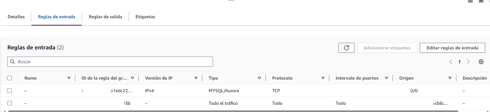
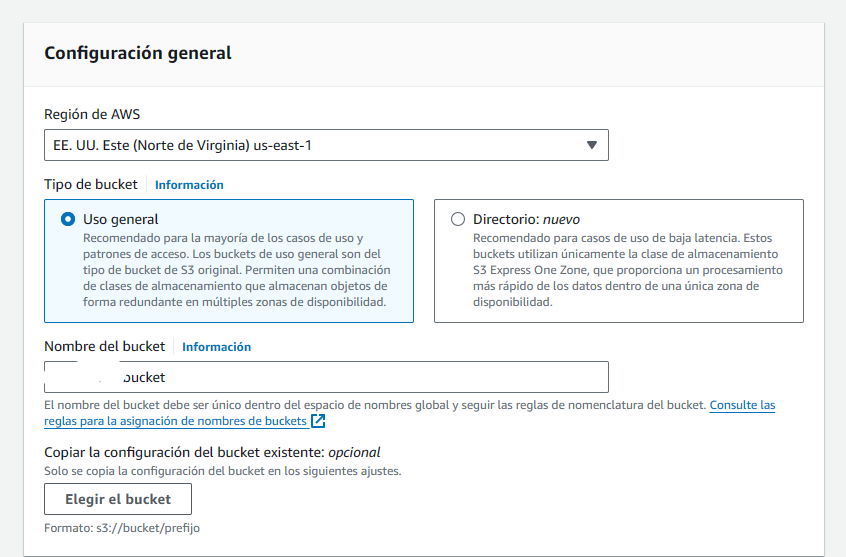
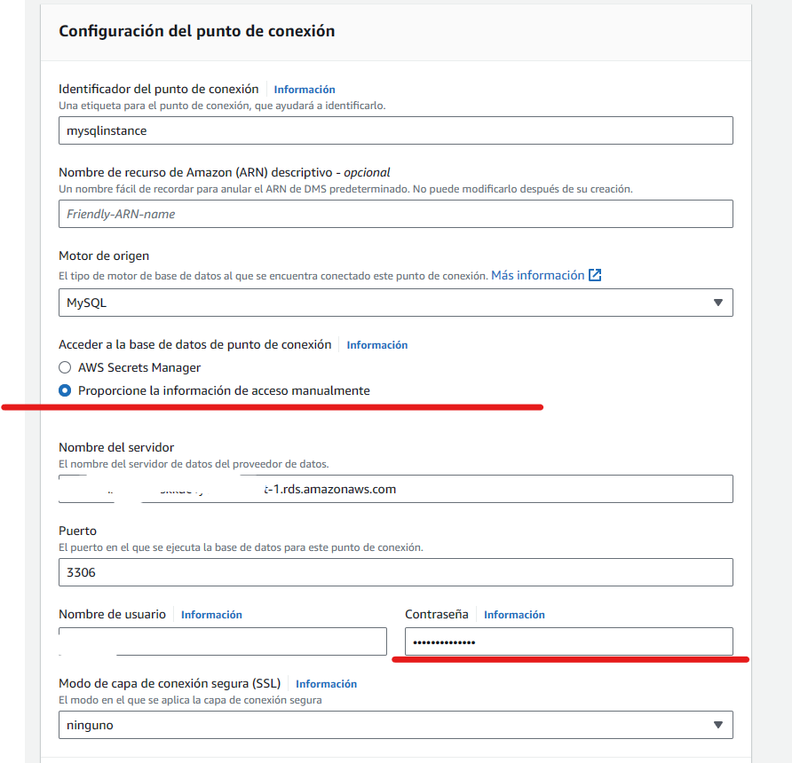
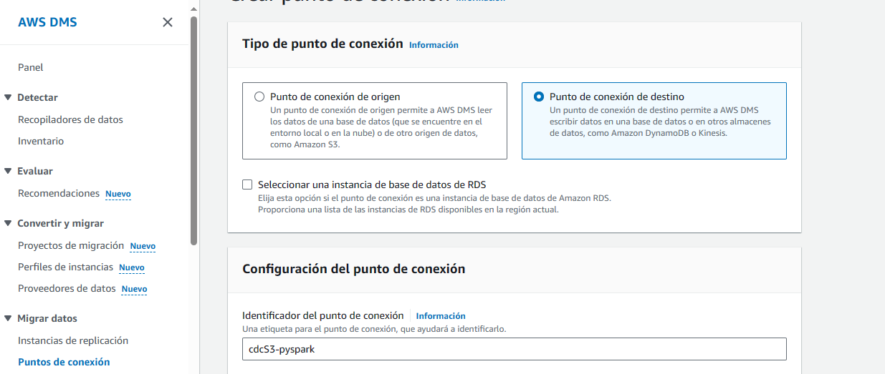
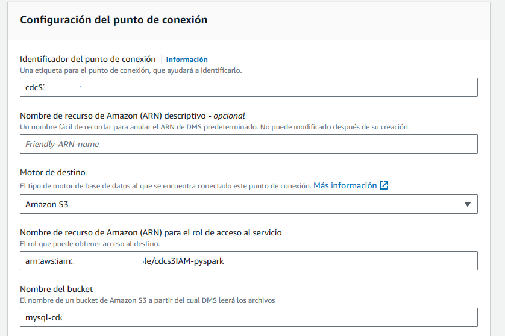
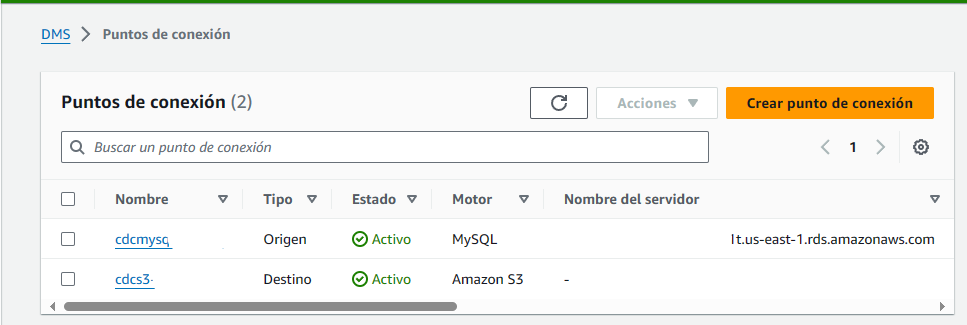
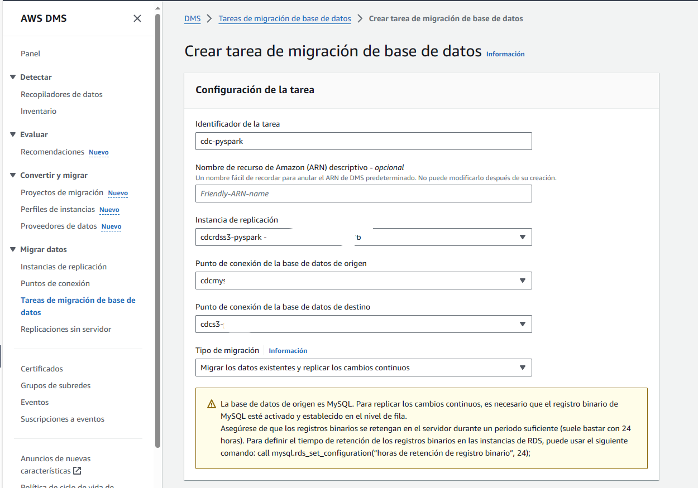
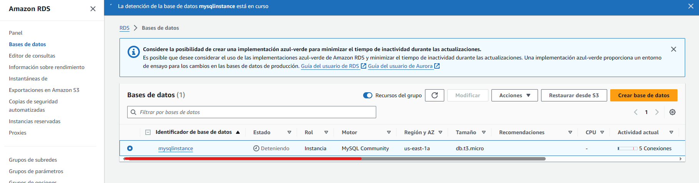

# Change Data Capture with PySpark

1. [Introduction](#1.-introduction)
2. [Proyecto y Arquitectura](#2.-proyecto-y-arquitectura)
3. [Creacion RDS](#3.-creacion-de-rds)
4. [Creacion S3 Bucket](#4.-creacion-s3-bucket)
5. [Creacion de DMS](#5.-creacion-de-dms)
    - [DMS - Source EndPoint]()
    - [DMS - Destination EndPoint]()
    - [DMS Instancia]()
6. [RDS y Dumping Data Connection](#6.-rds-y-dumping-data-connection)
7. [DMS full load](#7.-dms-full-load)
8. [DMS replication ongoing](#8.-dms-replication-ongoing)
9. [Stop instances](#9.-stop-instances)
10. [Glue jobs](#10.glue-jobs)
    - [Full Load]()
    - [Change capture]()
    - [Glue Job CDC]()
11. [Lambda function y Trigger](#11.-lambda-function-y-trigger)
    - [Testing y trigger]()
    - [Obtener FileName]()
    - [Creacion de Glue Job]()
    - [Testing Invoke]()
    - [Writing Glue Shell Job]()
12. [Full load pipeline](#12.-full-load-pipeline)
13. [CDC pipeline](#13.-cdc-pipeline)


## 1. Introduction

CDC sirve cuando tenemos una __base de datos__ que queremos replicar o capturar los cambios dentro de la misma y guardarlo en un archivo o __DataLake__

Los cambios que podemos capturar son __Delete__, __Insert__, __Update__

## 2. Proyecto y Arquitectura

Buscamos que todos los cambios que ocurran dentro de la __Base RDB__ se vean replicados en __HDFS / S3__

Para capturar estos datos vamos a crear un servicio en AWS llamado __DMS__ o __Data migration Service__ que deje en un __Bucket temporal__ el archivo con los cambios.

Cuando llegue un nuevo archivo al __Bucket Temporal__ esto dispara un trigger que activa una __lambda__ que llamará a un __job de PySpark__ usando GLUE pasandole el FileName.

Este __Job de GLUE__ va a leer data del __Bucket Temporal__ y lo pondrá en el __bucket FINAL: HDFS/S3__


## 3. Creacion de RDS

Lo primero que hacemos es crear la Base de datos __RDS__ con MySql, __USAR FREE TIER__

Nombre de la instancia: __mysqlinstance__

Para este proyecto usamos MySql y nos seguramos de usar la capa libre.


Elegimos un nombre de la Instancia y el nombre de usuario es __admin__


Nos aseguramos de estar usando __t3.micro__ porque es gratuito.


En conectividad dejamos los valores __default__


Lo mas importante viene en __configuración adicional__. Acá debemos activar el __backUp__ de la BD ya que es necesario para poder trabajar con __DMS__ y debemos crear __un grupo de parametros adicional__


__Creacion de un grupo de parametros adicional__

Abrimos otra ventana de __RDS__ y seleccionamos __Param Groups__
Creamos el nuevo Grupo para MySql 8.0. Las versiones deben coincidir. 


Visualizamos el Grupo creado.


Al crear el grupo, debemos cambiar el valor de un parametro __binlog_format__ a __ROW__ y guardarlo. 


Con el nuevo grupo disponible lo que hacemos es seleccionar el __Grupo de parametros__ en la ventana de creacion de la BD. Si no se actualiza solo, es necesario hacer __F5__ y volver a cargar.


Y creamos la __BD__


__IMPORTANTE__ REcordar que para poder logarnos en la instancia de BD debemos tener las reglas de __Inbound__ de la VPN activas para 0.0.0.0/0 Todas.


Si no tiene las reglas correctas las creamos.

Paso 1.


Paso 2.




## 4. Creacion de S3 Bucket

La segunda parte y __antes de crear los EndPoints__ vamos a crear el __S3 Bucket__.

Creamos un bucket con un nomber unico. __mysql-cdc-bucket__



Hacemos que el bucket sea publico


Y finalmente creamos el bucket


## 5. Creacion de DMS

En el tercer punto vamos a crear el __DMS__ o __Data Migration Service__

[Qué es Data Migration Service?](https://youtu.be/ouia1Sc5QGo)

[Caso de uso](https://docs.aws.amazon.com/dms/latest/oracle-to-aurora-postgresql-migration-playbook/index.html)


### 5.1 DMS - Source EndPoint

Creamos el Source Endopint y nos aseguramos de elegir la BD que creamos para la replicacion.


Automaticamente se cargan los datos de la __DRS__ y especificamos el usuario y password creados.



Creamos el __ENDPOINT___


### 5.2 DMS - Destination EndPoint

Creamos el destination Endpoint para el S3 Bucket.

Para poder crear un __endpoint__ para S3 debemos crear un Role IAM.

Primero creamos un __endpoint__ destino



Antes de seguir debemos crear un Role IAM que tenga permisos sobre DMS 
__Esto lo hacemos desde otra ventana al servicio IAM__


y FullAccess al Bucket S3.


vemos los detalles del role y lo creamos.


Lo que nos importa del role es su ruta, la cual copiamos y luego pegamos para crear el endpoint.


Cargamos los datos faltantes en el endpoint con el nuevo role creado.



Terminamos creando el EndPoint a un destino.



### 5.3 DMS Instancia

Hasta ahora tenemos La base de datos, el Bucket S3 y los dos EndPoints.
Ahora necesitamos crear la __INSTANCIA DE REPLICACION__ que usara DMS.

Dentro de DMS Service.


Lo mas importante al crear una instancia es hacerlo usando __t.micro__ gratuito y acceso publico.


## 6. RDS y Dumping Data Connection

Una vez creada la primera parte de la Arquitectura vamos a probar insertar datos.

Para esto usamos el archivo __DUMP__ en el directorio ./CBC_DATA.
EL mismo tiene la creacion del esquema, la tabla y los Inserts.

__ES MUY IMPORTANTE QUE LA TABLA TENGA PK, SINO REPLICATION ONGOING NO FUNCIONA__

Primero vamos a ejecutar la creacion del schema, la tabla y los inserts.


## 7. DMS Full Load

Ahora, despues de haber insertado los primeros datos podemos iniciar un proceso de migracion de datos con lo que tenemos hasta ahora.

1. ingresamos al servicio AWS DMS y al S3 para ver que los datos se estén copiando.

Dentro de DMS, creamos una tarea de __migracion de datos__

Elegimos un nombre para la Tarea, la instancia de replica que creamos y los EndPoints. En este punto debemos elegir __el tipo de replica__, en este caso elegimos __full load__ para que tome todos los cambios mas lo que ya existe. 



2. En las propiedades de la tabla dejamos todo tal cual pero cambiamos la cantidad de tablas a migrar en paralelo. Por defecto son 8 pero nosotors solo tenemos una.


3. En asignación de tablas especificamos los datos del esquema y la tabla que debe mirar el proceso.
Podemos usar __wildcards__ para elegir mas de una tabla o esquema.


4. DEsactivamos la evaluacion previa y especificamos que la nueva tarea se ejcute por primera vez al momento de ser creada.


5. Vemos que la tarea se creó y luego se ejecutó.


6. Si vamos a S3 vemos que se creó un directorio con la estructura __esquema/tabla/datos.csv__


## 8. DMS replication Ongoing

Luego de haber creado el __full load__ ahora podemos empezar a hacer cambios en la BD y ver como toma los cambios.

```sql
Select * from ahmad_schema.Persons
update ahmad_schema.Persons set FullName = 'ABC XYZ' where PersonId = 7;
INSERT INTO ahmad_schema.Persons VALUES (130,'Alica Bing','New York');
INSERT INTO ahmad_schema.Persons VALUES (131,'Malinda Bing','Detroit');
INSERT INTO ahmad_schema.Persons VALUES (132,'Chandler Bing','Portland');
update ahmad_schema.Persons set FullName = 'ABC XYZ' where PersonId = 8;
DELETE FROM ahmad_schema.Persons where PersonId = 10;
```

Ejecutamos este SQL y vamos al __BUCKET__ a ver el nuevo archivo generado.


Vemos lo que hay dentro del nuevo archivo generado.

```
U,7,ABC XYZ,Phoenix
I,130,Alica Bing,New York
I,131,Malinda Bing,Detroit
I,132,Chandler Bing,Portland
U,8,ABC XYZ,Denver
D,10,Jack Hicks,Houston
```

|accion|dato anterior|dato nuevo|
|------|-------------|----------|
|u-update|Phoenix|ABC XYZ|
|i-insert|no tiene|toda la linea
|d-delete|todo lo que trae|no tiene|


## 9. Stop Instances

Hasta ahora tenemos desarrollada la primera parte de la Arquitectura.


Como vamos a seguir trabajando en las funciones Lambda es una buena práctica detener la instancia para que no consuma recursos y __$$$__

1. Primero detenemos la tarea de migracion.


2. Luego detemos la instancia de DB.



## 10. Glue Jobs

Antes de crear la funciones lambda vamos a crear el __job de GLUE__.

Son los scripts. EL primero se encargará del __full-load__ y el segundo del __onGoing__


### 10.1 Full Load

1. Se crea el .py con nombre __SparkCDCFullLoad.ipynb__

Este archivo script tomará del __S3__ temporal el file full load y lo moverá al __S3__ final.

### 10.2 Change Capture

1. Este segundo proceso o script será el que captura los cambios. Tiene la escencia del proceso __CDC__

Por ahora lo vamos a poner dentro del mismo archivo ___SparkCDCFullLoad.ipynb__

__Pasos 3 y 3.1__

### 10.3 Glue Job CDC

Con el archivo creado (Script) agregamos la logica.
Para esto vamos a iterar sobre los registros del file __replication onGoing__ con tres opciones: una para Insert, Delete y otra para Update.

__Paso 4.__

En esta parte usamos el archivo de __Replication onGoing__ y le hacemos un loop por cada tipo de __operacion__ a cada registro.

Los que vamos a ahcer es replicar las operaciones que se hicieron en la __BD__ pero sobre el archivo __FullLoad__

1. Delete

Para elminar un registro del archivo __fullLoad__ lo que hacemos es volver a crear el archivo con un Filtro para no mostrar la __row__ que esta en el archivo __Replication onGoing__ 

```python
dfFullLoad = dfFullLoad.filter(col("id") != row["id"])
```

2. Update

Update es un poco mas difil, paa esto usamos el siguiente código.

```python
fdFullLoad =fdfFullLoad.withColum("fullName", \
    when(row["id"] == col("id"), row["fullName"]).\
        otherwise(fdFullLoad["fullName"]))

fdFullLoad = fdFullLoad.withColun("city", \
    when(row["id"]==col("id"), row["city"]).\
        otherwise(fdFullLoad["fullName"]))
```

3. Insert

Para hacer insert debemos usar la __row__ que se general en el for loop y convertirla a __DF__ y hacerle un __union__ al FD final.

```python
insertedRow = [list(row[1:])]
columns = ("id", "fullName", "city")
df_row = spark.createDataFrame(insertedRow, columns)
fdFullLoaf.union(df_row)
```

El union se hace por nombre de columna.


## 11. Lambda function y Trigger

EN esta seccion vamos a crear una funcion __lambda__ que recibe el nombre de un archivo y se lo pasa al script creado __en el punto anterior__
Esta funcion lambda se dispara cuando llega un nuevo archivo al __bucket temporal__.

CReamos una nueva funcion lambda desde __el servicio AWS Lambda__


El servicio lambda debe tener __un roll asociado para poder ejecutar__ asique creamos uno.


EL mismo desde tener tres perfiles o permisos full access. Para el Bucket, CloudWatch (logs) y Glue


Una vez creado volvemos a la pantalla de __lambda functions__ y seleccionamos el AIM Roll creado y creamos la funcion.


COn la funcion lambda creada vamos a __crear el trigger o desencadenadoe__ de S3.


Seleccionamos tipo desencadenador __S3__ y el bucket creado para el proyecto __CDC__ __Cuando creamos un desencadenador podemos elegir la carpeta que debe ver dentro del S3 o ponerle un prefeijo para que solo vea .csv__ en este caso lo dejamos por defecto. 


Con la funcion lambda y su desencadenador creada podemos testearla.


### 11.1 Testing Trigger


### 11.2 Obtener FileName

### 11.3 Creacion de Glue Job

### 11.4 Testing Invoke

### 11.5 Writing Glue Shell Job

## 12. Full load pipeline

## 13. CDC Pipeline

