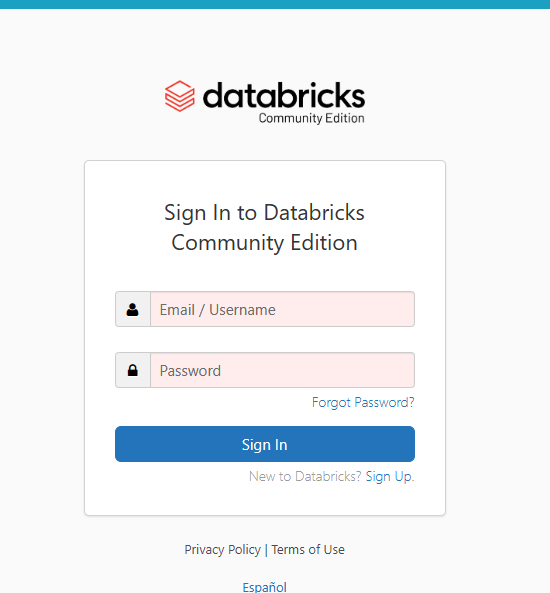
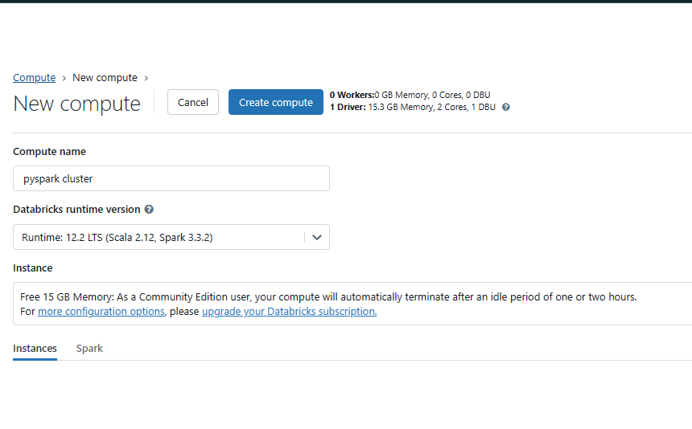
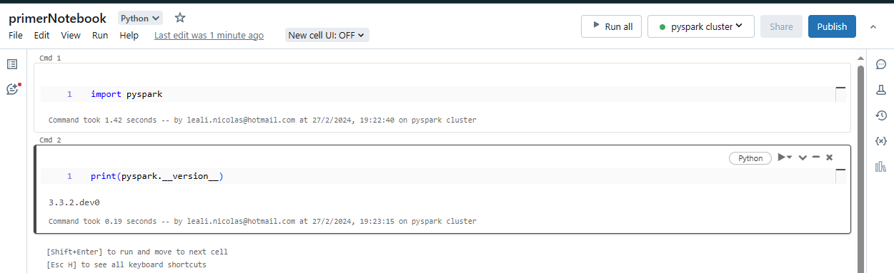
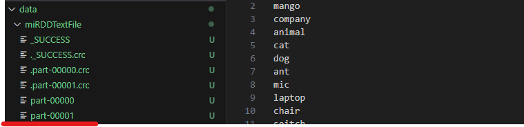

# Tutorial PySpark & AWS

1. [Introducción](#1.-introduccion)
    - [Materiales del curso](#.-materiales-del-curso)
2. [About Spark](#2.-about-spark)
    - [Ecosistema de Spark](#.-ecosistema-de-spark)
    - [Crear una cuenta con Databricks](#.-crear-una-cuenta-con-databricks)
3.  [Spark RDD](#3.-spark-rdd)
    - [Creacion de un RDD](#.-creacion-de-un-rdd)
    - [Submit un job en el cluster](#.-Submit-un-job-en-el-cluster)
    - [Spark RDD functions](#.-spark-rdd-functions)
    - [Ejercicio rapido 1](#.-ejercicio-rapido-1)
    - [Spark flatMap](#.-spark-flatMap)
    - [Spark rdd filter](#.-spark-rdd-filter)
    - [Ejercicio rapido 2](#.-ejercicio-rapido-2)
    - [Spark Distinct](#.-Spark-distinct)
    - [Spark GroupByKey](#.-spark-groupbykey)
    - [Spark ReduceByKey](#.-spark-reducebykey)
    - [Ejercicio rapido 3](#.-ejercicio-rapido-3)
    - [Spark Count y CountByValue](#.-spark-count-y-countbyvalue)
    - [Rdd saveAsTExtFile](#.-Rdd-saveAsTextFile)
    - [Rdd cambiar nro. de particiones](#.-rdd-cambiar-nro.-de-particiones)
    - [Rdd finding AVG](#.-rdd-finding-avg)
    - [Ejercicio rapido 3](#.-ejercicio-rapido-3)


## 1. Introduccion

PySpark es un Wrapper de Spark para Python. Se usa principalmente para el procesamiento en __streaming__ o __batch__ processing.

Tambien se puede usar en otros proyectos como __Machine Learning__

Unos de los principales casos de uso de __Spark__ es la creación de __pipelines__ ya que puede interecatuar con varios origenes y destinos de datos y __Full load__ y __Replication on going__ que es la carga masiva de datos y la posterior carga de lo que cambió en la fuente de los mismos.

```
El proyecto final será de CDC con Spark, Hadoop y AWS.
```

## Materiales del curso

[Link a GITHUB](https://github.com/AISCIENCES/course-master-big-data-with-pyspark-and-aws/tree/main)

## 2. About Spark

Spark es _rápido_ a comparacion de otros softwares que hacen lo mismo, es __distribuido__ permite tener o acceder archivos particionados en varios clusters y paralelizar.
Permite hacer analisis en tiempo real o __Streaming Processing__ y proveé una caché para los datos que son accedidos de forma repetida. Tambien es __Fault Tolerant__ si un nodo o worker se caé el trabajo es redirigido a otros.

## Ecosistema de Spark

EL cosistema de Hadoop esta formado por:

|artefacto|Descripcion|
|---------|-----------|
|HDFS|Es el file system de hadoop - distribuido (Storage)|
|YARN| Es el equivalente a un sistema Operativo|
|MapReduce| Es la tecnica para mapear datos |
|Spark| Resuelve las dificultades de MapReduce ya que Spark es una abstracción de Hadoop|


## 1. Arquitectura de Spark

Lo primero es el __Spark Context__ que contiene nuestro codigo a Ejecutar.
Luego está es __Cluster Manager__ que es el que controla y distribuye el trabajo entre los __Workers__
Finalmente estpan los __Workers__ que son los que se encargan de hacer el procesamiento necesario. 

## 2. Spark Ecosistem

El ecosistema de Spark incluye __SPARK SQL__ , __STREAMING SPARK__ , __SPARK MLlib__ y __SPARK GRAPHX__
Tambien tiene una API que permite trabajar con Java, Python y Scala.

## Crear una cuenta con Databricks

[Link DataBricks](https://community.cloud.databricks.com/login.html)

1. Crear Cuenta.



2. Elegimos __COMUNITY EDITION__ FOR PERSONAL USE.

3. Dentro de Databricks debemos crear un __cluster__ o en la nueva version __create compute__



4. Creamos una __Notebook__ y la ejecutams sobre __Python__ y seleccionamos el cluster que creamos.



Vemos que en la Notebook tenemos: EL interprete de Python que estamos usando y el __cluster__ al que estamos conectados.


## 3. Spark RDD

```
Son el componente central y mas importante de Spark. 
RDD son las siglas de Resiliant Distributed Dataset, tienen como propiedad que son inmutables y una coleccion de objetos distribuida.
Estos rdd estas distribuidos en los distintos clusters.
```

__IMPORTANTE__ RDD fué la implementación de Spark. Hoy no est tan utilizada pero si se necesita bajar el nivel de Abstracción son muy utiles.
EN la actualidad los __RDD__ fueron reemplazados por __DataFrames__ y estos por __SPARK SQL__

### Transformaciones y Acciones.

Una transformacion es siempre Lazy y crea un nuevo RDD a paritr de uno existente.
Una acción son las que disparan el flujo de datos. 

__Lazy Evaluation__ significa que no procesa hasta que es requerido por medio de una accion.

### Creacion de un RDD

En __SparkConfig__ es donde especificamos los origenes de datos o la configuracion necesaria para poder leer datos. 

__SparkContext__ es la parte central, es el entrypoint del programa. 

```python
from pyspark import SparkContext, SparkConfig

cf = SparkConfig().setAppName('readFile')
spark = SparkContext.getOrCreate(conf=cf)

text = spark.textfile("/mnt/d/Proyectos/Tutorial-SparkAWS/data/sampletext.txt")

miFile  = text.collect()
```

En este ejemplo __spark.textfile__ es una transformacion __lazy__ mientras que __collect()__ es una accion sobre el RDD que ejecuta la __lectura del archivo__

__Que pasa con el tipo de dato en cada una de estas variables?__

Cuando aplicamos la transformacion __spark.textfile__ crea un __rdd__ en la variable text, pero cuando sobre esta variable aplicamos __text.collect()__ esta accion devuelve una __lista__ haciendo que ya no se pueda usar __text__ para aplicar nuevas transformaciones, siempre se debe trabajar con __rdd__ y lo pultimo debe ser una __accion__


### Submit un job en el Cluster

El job anterior __ejemplo_submit.py__ le podemos hacer un submit al cluster.

```shell
spark-submit ejemplo_submit.py
```

### Spark RDD functions

1. __RDD MAP__ (Lambda)

Se usa para hacer un mapeo de datos de un estado a otro.
Como resultado crea otro RDD

```python
from pyspark import SparkContext, SparkConfig

cf = SparkConfig().setAppName('readFile')
spark = SparkContext.getOrCreate(conf=cf)

text = spark.textfile("/mnt/d/Proyectos/Tutorial-SparkAWS/data/sampletext.txt")

miFile  = text.map(lambda x:x.split(' '))

```

En este ejemplo la transformacion __map__ se aplica sobre el __rdd__ text y devuelve otro __rdd__ miFile con los registros separados por " ".

2. __Otras funciones de RDD__

A veces no queremos usar funciones __lambda__ asique podemos usar __funciones definidas por el usuario__

En este ejemplo lo que queremos hacer son dos cosas.
1. Separar la cadena de strings en 4 arrays
2. Castear cada elemento dentro del array a __int__ y sumarle 2.

```python
from pyspark import SparkContext, SparkConfig

cf = SparkConfig().setAppName('readFile')
spark = SparkContext.getOrCreate(conf=cf)

text = spark.textfile("/mnt/d/Proyectos/Tutorial-SparkAWS/data/sampletext.txt")

def mi_foo(x):
    l =  x.split(' ')
    ls = []
    for num in l:
        ls.append(int(num) + 2)
    return ls

miFile  = text.map(foo)
miFile.collect()
```

3. Ejercicio rapido


__sin lambda function__

Tenemos un archivo de texto con 3 frases. Queremos generar un array por cada frase con la logitud de cada palabra. 

```python
from pyspark import SparkContext, SparkConfig

cf = SparkConfig().setAppName('readFile')
spark = SparkContext.getOrCreate(conf=cf)

fileText = spark.textfile("/mnt/d/Proyectos/Tutorial-SparkAWS/data/wordcount.txt")

def foo(x):
    array = x.split(' ')
    l2 = []
    for word in array:
        l2.append(len(word))
    return l2

fileText.map(foo).collect()
```
__con lambda function__

hacemos el mismo ejercicio pero usando __lambda__.
Primero vamos a generar la lista de listas usando una __lambda__ con __split(' ')__ y a este resultado le agregamos una __list comprehention__ para determinar el numero de letras de cada palabra.

```python
from pyspark import SparkContext, SparkConfig

cf = SparkConfig().setAppName('readFile')
spark = SparkContext.getOrCreate(conf=cf)

fileText = spark.textfile("/mnt/d/Proyectos/Tutorial-SparkAWS/data/wordcount.txt")

fileText.map(lambda x:[len(word) for word in x.split(' ')]).collect()
```

### Spark flatMap

Devuelve los elementos como una unica entidad del mismo tipo.
Si tenemos una lista de lista, devuelve todo como un tipo de dato __unificado__ una sola lista generando un nuevo __rdd__

```python
from pyspark import SparkContext, SparkConfig

cf = SparkConfig().setAppName('readFile')
spark = SparkContext.getOrCreate(conf=cf)

fileText = spark.textfile("/mnt/d/Proyectos/Tutorial-SparkAWS/data/wordcount.txt")

fileText.flatmap(lambda x:x)
```

### Spark rdd filter

Se usa para elminar elementos de un __RDD__ tambien genera un nuevo __rdd__
Si la expresión final de la funcion lambda es true será considerada en el retorno de la función, de otra forma no.

```python
from pyspark import SparkContext, SparkConfig

cf = SparkConfig().setAppName('readFile')
spark = SparkContext.getOrCreate(conf=cf)

fileText = spark.textfile("/mnt/d/Proyectos/Tutorial-SparkAWS/data/wordcount.txt")

fileText.filter(lambda x: x in ('10 23 45 67', '87 54 34 101')).collect()
```

Esta expresión es de prueba porque siempre será __True__

__Podemos usar filter sin necesidad de una lambda function__ creando nuestra propia __UDF__

```python 
def foo(x):
    if x in ('10 23 45 67', '87 54 34 101'):
        return True
    return False

fileText.filter(foo).collect()
```

### Ejercicio rapido 2

```
Construir un filtro que elimine las palabras que comiencen con a o c y devolver todo en un flatMap
```

```python
fileText = spark.textFile("/mnt/d/Proyectos/Tutorial-SparkAWS/data/quiz2.txt")
fileText.collect()

fileText.flatMap(lambda x:x.split(' '))\
    .filter(lambda x: x.startswith("a") or x.startswith("c")).collect()
```

### Spark Distinct

Se usa para obtener valores distintos de un RDD.

```python
from pyspark import SparkContext, SparkConfig

cf = SparkConfig().setAppName('readFile')
spark = SparkContext.getOrCreate(conf=cf)

fileText = spark.textfile("/mnt/d/Proyectos/Tutorial-SparkAWS/data/wordcount.txt")

fileText.flatmap(lambda x:x.split(" ")).distinct().collect()
```

### Spark GroupByKey

Se usa para crear grupos basados en __keys__. Para que esta transformacion funciono bien, los datos deben estar presentados en forma de tuplas.
(key1, val1), (key2, val2)....(keyn, valn)
Devuelve un __RDD__ y para devolver los datos se combina con __mapValues(list)__ otra transformacion.

1. Se debe llevar cada registro a la forma de (key, val) usando __map__
2. Se aplica GroupByKey()

Cuando aplicamos GroupByKey lo que obtenemos es:

|Agrupacion|
|-------|
|(key1, [val1, val2, val3])|
|(key2, [val1, val2])|

Y estos valores son un iterable:

('1', <pyspark.resultiterable.ResultIterable at 0x7f74d82375b0>) que para poder visualizarlo usamos __mapValues__

resultado final: ('101', [1, 1, 1])

```python
from pyspark import SparkContext, SparkConfig

cf = SparkConfig().setAppName('readFile')
spark = SparkContext.getOrCreate(conf=cf)

fileText = spark.textfile("/mnt/d/Proyectos/Tutorial-SparkAWS/data/wordcount.txt")

rdd_split = text.flatMap(lambda x: x.split(' '))
rdd_key_val = rdd_split.map(lambda x: (x, 1))
rdd_reduce = rdd_key_val.groupByKey()
rdd_mapVal = rdd_reduce.mapValues(list).collect()
```

### Spark ReduceByKey

Es usado para combinar data basado en key en un RDD. Tiene los mismos requisitos de __GroupByKey__, los datos deben estar presentados en formato de Tupla (key, val).


```python
from pyspark import SparkContext, SparkConfig

cf = SparkConfig().setAppName('readFile')
spark = SparkContext.getOrCreate(conf=cf)

fileText = spark.textfile("/mnt/d/Proyectos/Tutorial-SparkAWS/data/wordcount.txt")

rdd_split = text.flatMap(lambda x:x.split(' '))
rdd_map = rdd_split.map(lambda x: (x, 1))
rdd_reduce = rdd_map.reduceByKey(lambda x,y: x + y)
print(rdd_reduce.collect())
```

¿Cómo funciona __reduceByKey__?

Es similar al GroupByKey, primero lo que hace es agrupar las mismas __keys__ y luego por un proceso __iterativo__ suma los valores __x+y__ hasta que sumo todos los valores de la __key__ dejando un unico par __(key,val)__

__Ejemplo__

|Rdd|iteracion|accion|
|---|---------|------|
|[('gato',1), ('gato',1), ('gato', 1)]|1|agrupa por key y suma:  (gato, 1) + (gato, 1)|
|[('gato',2), ('gato', 1)]|2|agrupa por key y suma: (gato, 2) + (gato, 1)
|[('gato 3)]|3|no hace nada|

### Ejercicio rapido 3

```
Hacer un script que devuelva la cantidad de cada palabra en el archivo de texto.
```

```python
textFile = spark.textFile("/mnt/d/Proyectos/Tutorial-SparkAWS/data/quiz2.txt")
type(textFile)

#textFile.collect()
rdd_flat= textFile.flatMap(lambda x:x.split(' '))
rdd_key_val = rdd_flat.map(lambda x: (x, 1))
rdd_reduce = rdd_key_val.reduceByKey(lambda x, y: x + y)
print(rdd_reduce.collect())
```

### Spark Count y CountByValue

__Count()__ es una acción que se aplica sobre un __rdd__ que devuelve la cantidad total de elementos.

__CounyByValue()__ devuelve la cantidad de veces que un elemento existe en un __rdd__ en un __dict__

```python
textFile = spark.textFile("/mnt/d/Proyectos/Tutorial-SparkAWS/data/quiz2.txt")
type(textFile)

#textFile.collect()
rdd_flat= textFile.flatMap(lambda x:x.split(' '))

print(rdd_flat.Count())
print(rdd_flat.CountByValue())
```

### Rdd saveAsTExtFile

```
Es una acción que se usa para guardar un RDD en un archivo de texto.
```

¿Como funciona?

Esta función crea una carpeta con el nombre que le pongamos al archivo y dentro crea un __rdd__ que estará dividido en __por defecto dos particiones__. Un archivo tendra el 60% de los datos y el otro el 40% aproximadamente.

```python
textFile = spark.textFile("/mnt/d/Proyectos/Tutorial-SparkAWS/data/quiz2.txt")
type(textFile)

#textFile.collect()
rdd_flat= textFile.flatMap(lambda x:x.split(' '))

rdd_flat.getNumPartitions()

rdd_flat.saveAsTextFile("../data/miRDDTextFile")
```



### Rdd cambiar nro. de particiones

Por defecto __el numero de particiones de un rdd es dos__ pero este valor se puede cambiar.

Para consultar el numero de particiones hacemos:

```python
rdd_x.getNumPartitions()
```

Para modificar el numero de particiones tenemos dos opciones:

|opcion|descricion|comando|resultado|
|------|----------|-------|---------|
|repartition|Se usa para cambiar el numero de particiones de un __rdd__ x| rdd.repartition(nro_de_particiones)|Crea un nuevo __rdd__|
|coalesce|Se usa para decrementar el numero de particiones en un __rdd__|rdd.coalesce(number_of_partitions)|Crea un nuevo __rdd__|


```python
textFile = spark.textFile("/mnt/d/Proyectos/Tutorial-SparkAWS/data/quiz2.txt")


rdd_flat = textFile.flatMap(lambda x:x.split(' '))
print(rdd_flat.getNumPartitions())

rdd_flat_4 = rdd_flat.repartition(4)
rdd_flat_4.saveAsTextFile("../data/miPartition")
print(rdd_flat_4.getNumPartitions())
```

En este ejemplo partimos de un __rdd__ con 2 particiones por defecto y se lo incrementamos a 4, por lo tanto __tendremos 4 archivos__

```python
print(rdd_flat_4.getNumPartitions())
rdd_flat_coalesce = rdd_flat_4.coalesce(1)
rdd_flat_coalesce.saveAsTextFile("../data/miPartitionColasce")
print(rdd_flat_coalesce.getNumPartitions())
```

Seguidamente tomamos el último __rdd__ de 4 particiones y se las reducimos a __una particion__ como resultado tendremos un __unico archivo en el directorio de particiones__

### Rdd finding AVG

Para esta practica vamos a trabajar con el dataset __movie_rating.csv__
Este dataset contiene:

|columnas|descripcion|
|--------|-----------|
|1|nombre de la pelicula (str)|
|2|raiting de la pelicula (int)|

Vamos a calcular por cada pelicula su __Raiting AVG__

1. Vamos a crear un nuevo RDD que tenga las __tuplas__ con (key, (val,1))donde key= pelicula y val= raiting y 1 es un numero constante que luego vamos a sumar para nos devuelva la __cantidad de ocurrencias__

```python
movieRDD = spark.textFile("/mnt/d/Proyectos/Tutorial-SparkAWS/data/movie_ratings.csv")
print(movieRDD.count())

movieRDD_map = movieRDD.map(lambda x: (\
                                        x.split(",")[0], \
                                        (int(x.split(",")[1]),1)
                                        )
                            )
```

2. Luego reducimos con un __.reduceByKey__ para obtener algo así:
(key, (suma(val), suma(1))) o lo que seria igual a 
(key, (x[0]+y[0], x[1]+y[1]))

```python
movieRDD_reduce = movieRDD_map.reduceByKey(lambda x, y: (x[0]+y[0], x[1]+y[1]))
print(movieRDD_reduce.collect())
```

3. Calculamos el promedio entre (x,y) para cada pelicula.

__importante__ a esta altura lo que tenemos es:

('The Shawshank Redemption', (12, 4))

|elemento|indice|descripcion|Detalle|
|--------|------|-----------|-------|
|('The Shawshank Redemption')|0|Key|The Shawshank Redemption'|
|(12, 4)|1|Val|Es una tupla que contiene la suma de los raitings y la cantidad de ocurrencias|

Lo que necesitamos hacer es una __lambda__ que reciba x y use x[0] para la __key__ x[1][0] para __la suma de los raitings__ y x[1][1] __para la cantidad de ocurrencias__ y calcule el promedio.

```python
movieRDD_reduce.map(lambda x:(x[0], x[1][0]/x[1][1])).collect()
```


### Ejercicio rapido 3

Para este ejecicio usamos el dataset __average_quiz_sample.csv__
donde lo que se busca es obtener el promedio por __mes__.
Optativo: __Se puede agregar datos al dataset y obtener un promedio por ciudad y mes__


__IMPORTANTE__ debemos darnos cuenta que no nos importa la columna __city__ asique una vez que hacemos el __split__ la eliminamos

```python
mesRDD = spark.textFile("/mnt/d/Proyectos/Tutorial-SparkAWS/data/average_quiz_sample.csv")
print(mesRDD.count())

mesRDD_map = mesRDD.map(lambda x: x.split(","))
mesRDD_map2 = mesRDD_map.map(lambda x: (x[0], (int(float(x[2])), 1)))
```

Con el RDD con la forma

(key, (raiting, 1)) __reducimos y sumarizamos__

```python

mesRDD_map2_reduce = mesRDD_map2.reduceByKey(lambda x, y: (x[0]+y[0], x[1] +y[1]) )

mesRDD_map2_reduce.map(lambda x:(x[0], x[1][0] / x[1][1])).collect()
```

__exactamente igual que el primer ejemplo de AVG__