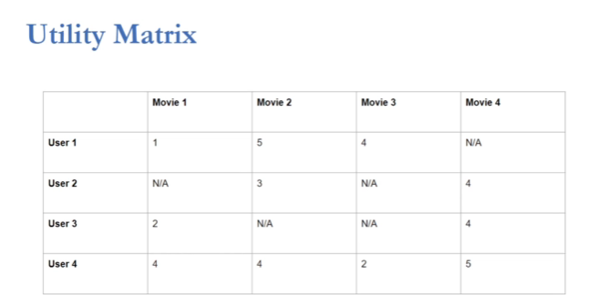

# DataFrames Advance topics

1. [Collaborative Filtering](#1.-collaborative-filtering)
    - [Utility matrix]()
    - [Explicit Implicit Ratings]()
    - [resultados esperados]()
    - [Datasets]()
2. [Joining DataFrames](#2.-joining-dataframes)
    - [Split train test]()
3. [Creacion del modelo](#3.-creacion-del-modelo)
4. [Tuning del modelo](#4.-tuning-del-modelo)


## 1. Collaborative filtering

```
Es similar a un modelo de ML llamdo Recommended Systems.
Es usado como un algoritmo para obtener o medir similitudes entre objetos y ofrecer resultados, como por ejemplo los uqe hace Netflix, Facebook, Amazon, Etc.
```

+ Utility Matrix



En una mátriz de filtering lo que intentamos hacer es determinar los valores faltantes en base a los valores disponibles en las celdas. En este caso intentar determinar el __rating__ que un uusario le hubiera dado a una pelicula teniendo en cuenta los __ratings__ que asignó a las peliculas que vío y los ratings asignados por otros usuarios.

+ Explicit Implicit ratings

Explicit, son otorgados por los usuarios
Implicit, Son determinados por la App dependiendo del tiempo que usuario usuario mira una pelicula, la cta de clicks, etc.

__Trabajar con implicit ratings es muy dificil y se requiera mucho conocimiento del negocio__


+ Resultado esperado

Tomando los datasets __movies__ y __ratings__ lo que esperamos es poder recomendar a los usuarios aquellas peliculas que no vieron e intentar asignarles un __rating__ en base a lo ya visto.


|usuario|movie|rating|
|-------|-----|------|
|1|101|4.5|
|1|102|3.7|
|2|89|4.5|
|3|76|2.75|


- Datasets

__IMPORTANTE__ El dataset __movies__ tiene las categorias de las epliculas separadas por __|__. 


## 2. Joining Dataframes

El join lo podemos hacer usando __DF__ o usando __SQL__

```python
df1.join(df2, on="fieldId", how="left|right|inner")
```

+ Split train test

```
En la mayoria de los casos de divide el set de datos en 80/20.
80% para entrenar el modelo y 20% para testear el modelo.
```

Para dividir los datos usamos el método del dataframe __randomSplit()__ que espera una lista con dos parametros, el total en % que irá a train y el de test.
Esto devuelve una tupla (train, test)

```python
(train, test) = df.randomSplit([.8, .2])
```

## 3. Creacion del modelo

Para la creacion del modelo vamos a usar los que ya vienen creados con Spark.

```python
from pyspark.ml.recommendation import ALS

als = ALS(userCol="userId", itemCol="movieId", ratingCol="rating", 
nonnegative=True, implicitPrefs=False, coldStartStrategy="drop")
```

Este modelo recibe los siguientes parámetros.

|parametro|descripcion|
|---------|-----------|
|userCol|Contiene el id de a quien le importa la recomenacion|
|itemCol| Es la columna sobre la que queremos hacer la ecomenación|
|ratingCol| La columna con el rating que usará el modelo|
|nonnegative| True|
|implicitPrefs| En este caso solo trabajamos con datos Explicitos: False|
|colStartStrategy| "drop" |


## 4. Tuning del modelo

```python
from pyspark.ml.evaluation import RegressionEvaluator
from pyspark.ml.tuning import ParamGridBuilder, CrossValidator
```

__1. Creamos un ParamGridBuilder__

```python
param_grid = ParamGridBuilder()\
    .addGrid(als.rank, [10, 50, 100, 150])\
    .addGrid(als.regParam, [.01, .05, .1, .15])\
    .build()
```

__¿Qué hace esto?__

El __GridBuilder__ crea nxn cantidad de modelos y usando __CrossValidator__ seleccionamos el mejor. EN este caso nuestro el .builder() creará 16 modelos.

__2. Creamos un regresor para evaluar__

```python
evaluator = RegressionEvaluator(
    metricName="rmse",
    labelCol="rating",
    predictionCol="prediction"
                                )
```

__3. Creamos el cross validator para el mejor modelo__

```python
cv = CrossValidator(
                    estimator=als,
                    estimatorParamMaps=param_grid,
                    evaluator=evaluator,
                    numFolds=5
                    )
```

__4. Entrenamos el modelo y buscamose el mejor__

```python
model = cv.fit(df_train)
best_model = model.bestModel
testPrediction = best_model.transform(df_test)
RMSE = evaluator(testPrediction)
```

__5. obtenemos las N mejores recomendaciones__

```
Usando .recommended(N) lo que obtenemos es el top N de las recomenaciones basadas en el mejor modelo de recomenaciones.
```

```python
recommendations = best_model.recommendedForAllUsers(5)
```


# FALTA COMPLETAR