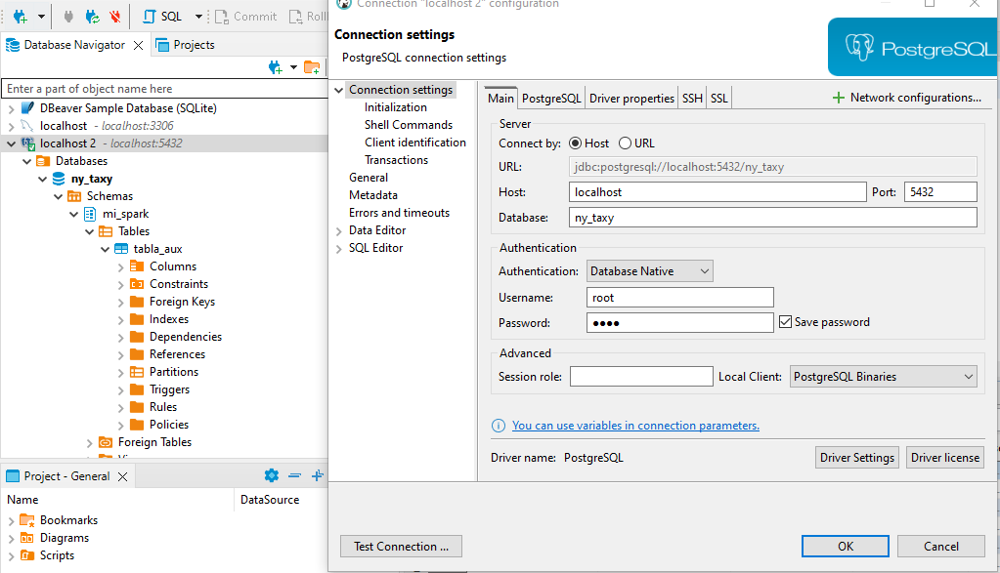

# ETL with PySpark

1. [Introduccion](#1.-introduccion)
2. [Carga de datos](#2.-Carga-de-datos)
3. [Transformacion de datos](#3.-transformacion-de-datos)
4. [Load data](#4.-load-data)
    - [Entorno Local  - Docker]()
    - [Entorno AWS]()
5. [Recursos importantes](#5.-recursos-importantes)

## 1. Introduccion

ETL significa Extraccion, Transformacion y Carga.


- __Introducción al proyecto.__

```
En este proyecto vamos a extraer datos de un .txt, contar la ocurrencia de palabras y cargarlo en un RDB AWS Postgres.
```

En este proyecto trabajamos con el archivo __WordData.txt__ que tiene varias frases.


## 2. Carga de datos

```python
from pyspark.sql import SparkSession

spark = SparkSession.builder.appName("ETLtest").getOrCreate()
```

```python
df = spark.read.csv(path)
```

__Con el df cargado debemos procesarlo de tal forma que podamos contar la ocurrencia de palabras__

## 3. Transformacion de datos

Para poder contar la ocurrencia de palabras dentro de una linea debemos convertir al siguiente formato:

[palabra1, palabra2, palabra3, palabra4]

Para esto podemos usar la funcion __explode__, toma una lista de elementos y lo transpone en columnas

|col|
|---|
|palabra 1|
|pablabra 2|
|...|
|...|
|palabra n|

```python
import  pyspark.sql.functions as

df = df.withColumn("splitColumn", f.split(col"value"), " ")
```

Este primer paso convierte cada linea en un __array__

```python
df = df.withColumn("splitColumnExplode", f.explode(col("splitClumn")))
df.show()
```

|linea|array -split|explode|
|-----|------------|-------|
|This is a Japanes|[this, is, a , Japanese]|this|
|This is a Japanes|[this, is, a , Japanese]|is|
|This is a Japanes|[this, is, a , Japanese]|a|
|This is a Japanes|[this, is, a , Japanese]|japanese|

Al tener las palabras separadas podemos empezar a contarlas con un __groupBy__

```python
df_group = df.groupBy("splitedDataExplode").count()
df_group.show(4)
```

## 4. Load data

Hay dos formas de cargar datos en una base de datos. Podemos usar un Entorno Local con Docker y otra creando un entorno en la nube.

1. __Entorno Local__

Para poder crear un entorno LOCAL vamos a usar DOCKER y crear una imagen de __Postgres__

1.1 Creacion de la Imagen.

Creamos un directorio en WSL - Ubuntu con el nombre __docker_img__ con los archivos:
- ./postgres/dockerfile
- ./docker-compose.yml

y un directorio __postgres_volume__ donde guardaremos la BD.

1.2 Archivo ./postgres/dockerfile

```yml
FROM postgres:latest
```

1.3 Archivo ./docker-compose.yml

```yml
services:
  pgdatabase:
    build: ./postgres
    environment:
      - POSTGRES_USER=root
      - POSTGRES_PASSWORD=root
      - POSTGRES_DB=ny_taxy
    volumes:
      - "./postgres_volume/:/var/lib/postgresql/data:rw"
    ports:
      - "5432:5432"
  pgadmin:
    image: dpage/pgadmin4
    environment:
      - PGADMIN_DEFAULT_EMAIL=admin@admin.com
      - PGADMIN_DEFAULT_PASSWORD=root
    ports:
      - "8080:80"
```

1.4 Creacion de las imagenes.

Desde la terminal de Ubuntu ejecutamos 

```
docker-compose up -d
```

Vemos que las imagenes fueron creadas y desde Windows podemos ver que se puede ver los contenedores ejecutando. __Es necesario tener activa la ntegracion WSL2__


Tambien podemos acceder por __dbeaver__



Creamos un Esquema para insertar datos y crear una tabla.

```sql
create schema my_spark
```

1.5 Descargamos JDBC de Postgres

```
Para poder usar postgres con PySpark debemos descargar los .jar correctos.
```

[jdbc postgres LINK](https://jdbc.postgresql.org/download/)

una vez descagados en el directorio de los jars en spark.

```shell
wget link
```

debemos reiniciar el motor de Spark para que los cambios tomen efecto y dbemos crear la sesion especificando los __jars que queremos usar__

```python
spark = SparkSession.builder.appName("ETLtest").\
    config("spark.jars", "postgresql-42.7.3.jar").\
        getOrCreate()
```

Creamos las variables para conectar con la BD

```python
driver = "org.postgresql.Driver"
url = "jdbc:postgresql://localhost:5432/ny_taxy"
user = "root"
password = "root"
db = "ny_taxy"
tables = "mi_spark.tabla_aux"
```

y finalmente pasamos el DF que queremos grabar.

```python
df_group.write.format("jdbc").option("driver", driver).\
    option("url", url).\
        option("dbtable", tables).\
            mode("append").\
                option("user", user).\
                    option("password", password).\
                        save()
```

Para leer de una BD es similar, pero en lugar de .save() usamos .load()

```python
rd_df = spark.read.format("jdbc").option("driver", driver).\
    option("user", user).\
        option("password", password).\
            option("url", url).\
                option("dbtable", "mi_spark.tabla_aux").load()
```

2. __Entorno AWS__

En este ejemplo y siguiendo con los datos anteriores creamos el mismo ejemplo pero usando postgres en AWS con Free Tier.

En el buscador, buscamos RDS


Esta base la creamos en la capa gratuita, con usuario y password.
__IMPORTANTE__ Una vez creada la base __RDB__ debemos recordar se setear las reglas __inbound__ de la VPN porque no vienen configuradas.

1. Ingresamos a la consola y buscamos el servicio __RDB__


2. Dentro del servicio creamos una nueva base de datos. La misma debe ser __standard__


3. Seleccionamos Postgres y nos aseguramos de tener el __free tier__ 


4. __free tier__ y Version de postgres.


5. Seleccionamos un Nombre de la Instancia y la clave/usuario con la que nos vamos a conectar.


6. Nos aseguramos que la instancia sea t3 micro.


7. Dejamos el almacenamiento por defecto pero eliminamos los __backups__


8. Es importante que la conectividad sea por acceso publico con la VPN por defecto.


9. EN configuracion adicional dejamos todo por defecto.


10. Confirmamos que el costo mensual estimado es de 0$ usando la __free tier__


11. Vemos la creación de la instancia de Postgres.


12. Vemos los detalles de la conexión de Postgres como el Host, la VPN y el __Aacceso publico__

__IMPORTANTE__ en este punto por mas que veamos que el acceso es público es necesario controlar que la seguridad de la VPN permite el acceso a los recursos. (REGLAS DE INBOUND)


13. Controlamos que el grupo de seguridad tenga habilitadas las reglas de acceso para __POSTGRES__


14. EN 13.,  vemos que no está creada la regla de Inbound así que la creamos. Debe permitir todo el trafico.


15. Configuramos la conexion para poder comprobar que nos podemos conectar.


15.1 Creamos un schema donde vamos a crear una tabla para guardar los datos del __DF__

```sql
create schema my_conexion_spark;
```

__Esto lo ejecutamos por sql script__

15.2 Creamos las variables de la conexión en pyspark.

```python
driver = "org.postgresql.Driver"
url = "jdbc:postgresql://mipruebapyspark.cdqe2q4c2zqa.sa-east-1.rds.amazonaws.com/"
user = "postgres"
password = ""
tables = "my_conexion_spark.tabla_aws"
```

15.3 Ejecutamos el proceso para cargar los datos.

```python
df_group.write.format("jdbc").option("driver", driver).\
    option("url", url).\
        option("dbtable", tables).\
            mode("append").\
                option("user", user).\
                    option("password", password).\
                        save()
```

16. Controlamos que la tabla se haya creado y los datos esén insertados.


```python
rd_df = spark.read.format("jdbc").option("driver", driver).\
    option("user", user).\
        option("password", password).\
            option("url", url).\
                option("dbtable", "my_conexion_spark.tabla_aws").load()
```

```python
rd_df.filter(col("splitedDataExplode")=="Tomorrow").\
    groupby(col("splitedDataExplode")).\
        sum("count").\
            show()
```

## 5. Recursos importantes

Buenos recursos de PySpark y Postgres ETL

1. [Pyspark-Postgres](https://mmuratarat.github.io/2020-06-18/pyspark-postgresql-locally)
2. [Pyspark JDBC](https://spark.apache.org/docs/latest/sql-data-sources-jdbc.html)
3. [Pyspark-postgres-2](https://www.machinelearningplus.com/pyspark/pyspark-connect-to-postgresql/#google_vignette)
