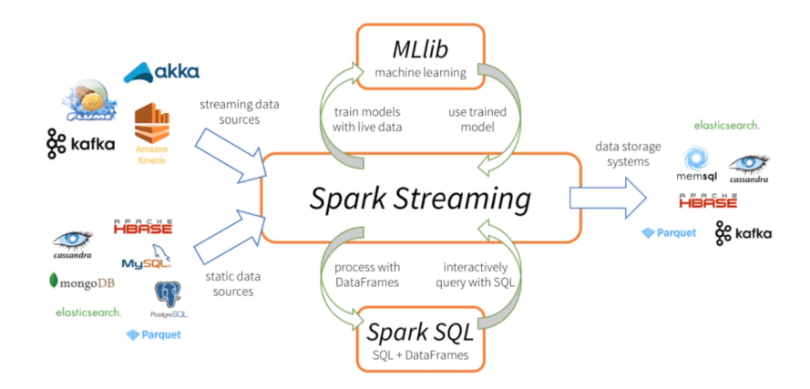

# Data Streaming With PySpark

1. [Introduccion](#1.-introduccion)
2. [Streaming RDD](#2.-Streaming-RDD)
    - [restar cluster]()
3. [Transformaciones](#3.-transformaciones)
    - [RDD - reduceByKey]()
4. [Streaming with DF](#4.-streaming-with-df)
    - [transformaciones]()


## 1. Introduccion

Spark Data Streming nos permite leer datos en __near real time__ y procesarlos para luego persistirlos.



A diferencia del procesamiento __BATCH__ los datos no neecsariamente deben estar persistidos para que sean procesados. Los mismos van llegando mientras son procesados. Pueden ser datos o archivos que se van guardando dentro de un directorio HDFS.

## 2. Streaming RDD

```
A diferencia de BATCH, cuando procesamos streaming, spark espera que conectemos la session a un proceso de streaming. 
```

Para poder trabajar con __Streaming__ en pyspark debemos inicializar un contexto en Spark y en Spark Streaming

```python
from pyspark.streaming from StreamingContext
from pyspark import SparkContext, SparkConf
```

1. Creamos el contexto de PySpark

```python
conf = SparkConf().setAppName("StreamingApp")
sc = SparkContext.getOrCreate(conf=conf)
```

2. Creamos el contexto de SparkStreaming

```python
ssc = StreamingContext(sc, 1)
```

__sc__ es el contexto de PySpark, mientras que __1__ representa el intervalo en segundos para la lectura del buffer de Streaming.


3. Streaming FileLocation

Debemos especificar cual es el directorio donde vamos a esperar los archivos para leer en streaming.
Estos archivos una vez que son recibidos se leen en formato de __RDD__.

```python
rdd = ssc.textFileStream("/mnt/d/Proyectos/Tutorial-SparkAWS/streaming_data/")
```

Cuando especificamos el directorio, lo hacemos en un bloque aparte porque sinó daría error.

```python
rdd.pprint()
ssc.start()
ssc.awaitTerminationOrTimeout(100)
```

__ssc.start__ Indica que debe comenzar el proecso de streaming
__ssc.awaitTerminationOrTimeout(100)__ Indica loque debe esperar hasta leer el proximo archivo que llega.


4. Restart Cluster.

Si necesitamos reinicar el contexto de Streaming lo uqe debemos hacer es eliminar el contenido del directorio sobre el que grabamos el archivo. Si no funciona hay que eliminar tambien el directorio.


## 3. Transformaciones

1. RDD - reduceByKey()

Especificamos donde debe busacr los nuevos archivos que van llegando.

```python
rdd = ssc.textFileStream("/mnt/d/Proyectos/Tutorial-SparkAWS/streaming_data/")
```

Especificamos la transformacion que queremos aplicar.

```python
rdd = rdd.map(lambda x: (x,1))
rdd = rdd.reduceByKey(lambda x,y: x+y)

rdd.pprint()
ssc.start()
ssc.awaitTerminationOrTimeout(100)
```

Este codigo de ejemplo nos trae el agrupado por pablabras dentro del archivo.

## 4. Streaming with DF

Cuando trabajamos con __DF__ es un poco distinto a trabajar con __RDD__.
Cuando usamos __RDD__ debemos crear un contecto de __PySpark__ y uno para __SparkStreaming__.
Pero al trabajar con __DF__ solo debemos crear una __SparkSession__ y usar un método __readStream__ similar al que usamos cuando leemos un archivo.

```python
from pyspark.sql import SparkSession

spark = sparkSession.builder.appName('streamingDF').getOrCreate()

word = spark.readStream.text("/mnt/d/Proyectos/Tutorial-SparkAWS/streaming_data/")
word.writeStream.format("console").outputMode("update").start()
```

- __Como hacer transformaciones sobre el DF?__

```python
from pyspark.sql import SparkSession

spark = sparkSession.builder.appName('streamingDF').getOrCreate()

word = spark.readStream.text("/mnt/d/Proyectos/Tutorial-SparkAWS/streaming_data/")

word = word.groupBy("value").count()
```

Este modelo de __Streaming__ funciona cuando cargamos un nuevo archivo, vuelve a raclacular los totales.

```python
word.writeStream.format("console").outputMode("update").start()
```